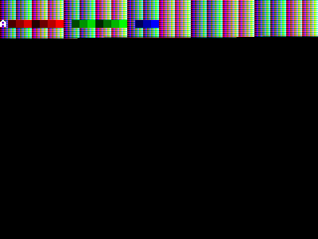

# Simulation

For simulation iverilog and GTKWave are used to verify the design before running it on an FPGA. I like iverilog because it is fast and simple to use from command line scripts. GTKWave is a fast, simple and intuitive tool to view the resulting waveforms for debugging and verification. I specifically avoided using the integrated simulator from Xilinx (or Altera back when I use a Cyclone FPGA), as these are slow, proprietary, unintuitive and way more complex than needed while being more difficult to automate.

It is required to use iverilog >= 12.0.
A simulation can be started by running the relevant script in `Scripts/Simulation/`. 
Depending on the script started, test code might be assembled and placed as initialization file in memory, with the purpose to simulate certain instructions.
Simulation test code can be found in places like `Software/BareMetalASM/Simulation/`.

Running the simulation script will show logs from `vvp` in the terminal:

## Waveform

The simulation script will also start GTKWave with the generated waveform and some pre-configured configuration file.

## GPU

To test the pixel output of the GPU in simulation, GTKWave is not very useful as it does not show the resulting image that would display on the screen assuming the display connection works. To verify the pixel output the GPU contains some verilog code that creates a new ppm file each vsync pulse and writes the color values per pixel to that file. The ppm file format is an easy way to create an image by just using text in a structured way. Ubuntu supports viewing this image format out of the box. See below for an example frame for a partially completed test signal. Note that you do need to simulate for an entire frame duration to create a complete frame, which can take multiple seconds.

