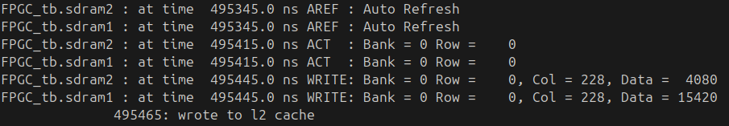
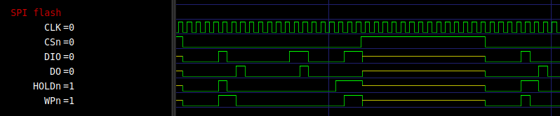
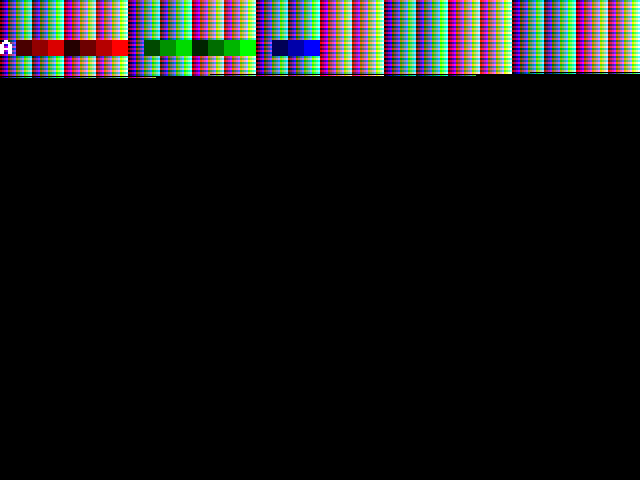

# Development Workflows

This guide covers the development workflows for the main components of the FPGC project: how to make changes, test them, and debug issues.

!!! note
    All commands should be run from the project root directory.

## Project Setup and Full Check

Running `make` without arguments will automatically set up the project (create virtual environment, build the compiler, install the assembler) and run all checks:

```bash
make
```

To run all checks without setup (format check, lint, and all tests):

```bash
make check
```

This is CI-safe and will exit with a non-zero status if any check fails.

## Quick Reference

| Component | Test Command | Debug Command |
|-----------|--------------|---------------|
| Verilog (CPU) | `make test-cpu` | `make debug-cpu file=<test>` |
| Verilog (GPU) | - | `make sim-gpu` |
| Verilog (SDRAM) | - | `make sim-sdram` |
| ASMPY Assembler | `make test-asmpy` | - |
| B32CC Compiler | `make test-b32cc` | `make debug-b32cc file=<test>` |
| **All checks** | `make check` | - |

---

## Verilog

The Verilog sources live in `Hardware/FPGA/Verilog/`. After writing or modifying Verilog code, it's important to run simulations to verify correctness before testing on actual hardware. I would argue that simulation is the most important part of Verilog development as logic quickly becomes too complex to validate by just looking, hardware testing takes really long and most importantly does not give insight into what is actually happening inside the design. Simulations solve all these issues and can be automated.

### Simulation

For simulation iverilog and GTKWave are used to verify the design before running it on an FPGA. I like iverilog because it is fast and simple to use from command line scripts. GTKWave is a fast, simple and intuitive tool to view the resulting waveforms for debugging and verification. I specifically avoided using the integrated simulator from Xilinx and Altera as these are slow, proprietary, unintuitive and way more complex than needed while being more difficult to automate (or at least have a too steep learning curve that quickly made me switch towards iverilog when I was just starting to learn Verilog).

!!! Note
    It is required to use iverilog >= 12.0 as older versions do not support certain features used in the testbenches.

Running single simulations (via the `make` commands below) will show logs from `vvp` in the terminal and open GTKWave with the generated waveform and some pre-configured configuration file.




### Running tests and simulations

**CPU tests:**

```bash
make test-cpu
```

Runs all assembly tests in `Tests/CPU/`, checking UART output. Each test executes twice: once from ROM and once from RAM/SDRAM (to exercise cache and memory controller paths).

**Single CPU test:**

```bash
make test-cpu-single file=1_load.asm
```

Runs a single CPU test (both ROM and RAM) for faster iteration when working on a specific test.

**Debug a CPU test:**

```bash
make debug-cpu file=1_load.asm
```

Assembles a single CPU test, runs the simulation, and opens GTKWave for waveform inspection.

**Interactive CPU simulation:**

```bash
make sim-cpu
```

Builds `Software/BareMetalASM/Simulation/sim_rom.asm` (ROM), `sim_ram.asm` (RAM), and `sim_spiflash1.asm` (SPI Flash 1), runs the simulation, and opens GTKWave with preconfigured views. To simulate running a program via the UART bootloader (`sim_uartprog.asm`), use `make sim-cpu-uart`.

**GPU-only simulation:**

```bash
make sim-gpu
```

Runs the GPU testbench, opens GTKWave, and outputs PPM images of each rendered frame for visual verification.

To test the pixel output of the GPU in simulation, GTKWave is not very useful as it does not show the resulting image that would display on the screen assuming the display connection works. To verify the pixel output the GPU contains some verilog code that creates a new ppm file each vsync pulse and writes the color values per pixel to that file. The ppm file format is an easy way to create an image by just using text in a structured way. Ubuntu supports viewing this image format out of the box. See below for an example frame for a partially completed test signal. Note that you do need to simulate for an entire frame duration to create a complete frame, which can take multiple seconds depending on the included files to simulate. Also, you might have to adjust the GPU clock speed in simulation if you want to avoid partially drawn frames like below.



**SDRAM controller:**

```bash
make sim-sdram
```

Runs the SDRAM controller testbench to verify timing and functionality (primarily used during initial development).

**Add a CPU test:**

```asm
; Tests/CPU/my_new_test.asm
Main:
   load 37 r15 ; expected=37
   halt
```

Expectations: entry label `Main`, result in `r15`, and an `; expected=XX` comment. Run with `make test-cpu`.

---

## ASMPY Assembler

ASMPY (Python-based) is in `BuildTools/ASMPY/`.

**Run tests:**

```bash
make test-asmpy
```

**Lint and checks:**

```bash
make lint
```

After changes, it’s good to run assembler-dependent tests to see if those still pass:

```bash
make test-cpu
make test-b32cc
```

---

## B32CC Compiler

B32CC (based on SmallerC) resides in `BuildTools/B32CC/`.

**Build:**

```bash
make b32cc
```

The compiler rebuilds automatically when `smlrc.c` or `cgb32p2.inc` changes.

**Run all tests:**

```bash
make test-b32cc
```

Compiles all C tests in `Tests/C/`, simulates, and verifies results.

**Single test:**

```bash
make test-b32cc-single file=3_1_if_statements.c
```

Faster when iterating on one feature.

**Debug a test:**

```bash
make debug-b32cc file=3_1_if_statements.c
```

Workflow: compile C to assembly, copy to `Software/BareMetalASM/Simulation/sim_ram.asm`, set ROM to jump to RAM, then open simulation via `make sim-cpu`.

**Add a C test:**

```c
// Tests/C/my_test.c
int main() {
    int result = 42;
    return result; // expected=0x2A
}

void interrupt() {
    // Required interrupt handler
}
```

Include `// expected=0xXX` for the return value. Run with:

```bash
make test-b32cc-single file=my_test.c
```

**Test categories:**

- `1_*`: basics (returns, variables)
- `2_*`: functions (calls, args, returns)
- `3_*`: control flow (if/while/for, combined)
- `4_*`: ...

---

## Documentation

The docs use MkDocs with Material.

**Serve locally:**

```bash
make docs-serve
```

Opens `http://localhost:8088` with live reload.

**Deploy:**

```bash
make docs-deploy
```

Deploys to my personal server (requires SSH access).
