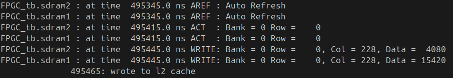
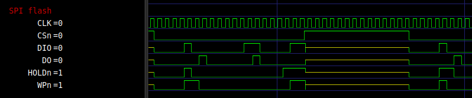

# Development Workflows

This guide covers the development workflows for the main components of the FPGC project: how to make changes, test them, and debug issues. All commands should be run from the project root directory.

## Project Setup and Full Check

Running `make` without arguments will automatically set up the project (create virtual environment, build the compiler, install the assembler) and run all checks:

```bash
make
```

To run all checks without setup (format check, lint, and all tests):

```bash
make check
```

This is CI-safe and will exit with a non-zero status if any check fails.

## Quick Reference

| Component | Test Command | Debug Command |
|-----------|--------------|---------------|
| Verilog (CPU) | `make test-cpu` | `make debug-cpu file=<test>` |
| Verilog (SDRAM) | - | `make sim-sdram` |
| Verilog (Bootloader) | - | `make sim-bootloader` |
| ASMPY Assembler | `make test-asmpy` | - |
| C Compiler (cproc+QBE) | `make test-c` | `make test-c-single file=<test>` |
| Kernel (BDOS) | `make compile-kernel` | `make run-kernel` |
| User programs | `make compile-userbdos file=<name>` | `make run-userbdos file=<name>` |
| Host tests (libterm) | `make test-host` | - |
| ASM-link tests | `make test-asm-link` | - |
| CPP tests | `make test-cpp` | - |
| **All checks** | `make check` | - |

---

## Verilog

The Verilog sources live in `Hardware/FPGA/Verilog/`. After writing or modifying Verilog code, it's important to run simulations to verify correctness before testing on actual hardware. I would argue that simulation is the most important part of Verilog development as logic quickly becomes too complex to validate by just looking, hardware testing takes really long and most importantly does not give insight into what is actually happening inside the design. Simulations solve all these issues and can be automated.

### Simulation

For simulation iverilog and GTKWave are used to verify the design before running it on an FPGA. I like iverilog because it is fast and simple to use from command line scripts. GTKWave is a fast, simple and intuitive tool to view the resulting waveforms for debugging and verification. I specifically avoided using the integrated simulator from Quartus as these are slow, proprietary, unintuitive and way more complex than needed while being more difficult to automate (or at least have a too steep learning curve that quickly made me switch towards iverilog when I was just starting to learn Verilog).

Requires iverilog >= 12.0, as older versions do not support certain features used in the testbenches.

Running single simulations (via the `make` commands below) will show logs from `vvp` in the terminal and open GTKWave with the generated waveform and some pre-configured configuration file.




### Running tests and simulations

By default, the CPU and C tests run in parallel with 4 workers to prevent crashes on machines with low RAM (<16GB), as each simulation uses quite a bit of RAM. To adjust the worker count, set the `FPGC_TEST_WORKERS` environment variable (e.g. `export FPGC_TEST_WORKERS=12` in `~/.bashrc`).

**CPU tests:**

```bash
make test-cpu
```

Runs all assembly tests in `Tests/CPU/`, checking UART output. Each test executes twice: once from ROM and once from RAM/SDRAM (to exercise cache and memory controller paths).

**Single CPU test:**

```bash
make test-cpu-single file=1_load.asm
```

Runs a single CPU test (both ROM and RAM) for faster iteration when working on a specific test.

**Debug a CPU test:**

```bash
make debug-cpu file=1_load.asm
```

Assembles a single CPU test, runs the simulation, and opens GTKWave for waveform inspection.

**Interactive CPU simulation:**

```bash
make sim-cpu
```

Builds `Software/ASM/Simulation/sim_rom.asm` (ROM), `sim_ram.asm` (RAM), and `sim_spiflash1.asm` (SPI Flash 1), runs the simulation, and opens GTKWave with preconfigured views.

**Bootloader simulation:**

```bash
make sim-bootloader
```

Compiles the bootloader with `--simulate` and runs it in the CPU simulation.

**SDRAM controller:**

```bash
make sim-sdram
```

Runs the SDRAM controller testbench to verify timing and functionality (primarily used during initial development).

**Add a CPU test:**

```asm
; Tests/CPU/my_new_test.asm
Main:
   load 37 r15 ; expected=37
   halt
```

Expectations: entry label `Main`, result in `r15`, and an `; expected=XX` comment. Run with `make test-cpu`.

---

## ASMPY Assembler

ASMPY (Python-based) is in `BuildTools/ASMPY/`.

**Run tests:**

```bash
make test-asmpy
```

**Lint and checks:**

```bash
make lint
```

After changes, it’s good to run assembler-dependent tests to see if those still pass:

```bash
make test-cpu
make test-c
```

---

## C Compiler (cproc + QBE)

The primary C toolchain uses [cproc](https://sr.ht/~mcf/cproc/) (C11 frontend by Michael Forney) and [QBE](https://c9x.me/compile/) (SSA backend by Quentin Carbonneaux), both with custom B32P3 backends. Sources are in `BuildTools/cproc/` and `BuildTools/QBE/`. Tests live in `Tests/C/`.

**Build:**

```bash
make qbe cproc
```

Both rebuild automatically when their sources change.

**Run all tests:**

```bash
make test-c
```

Compiles all C tests in `Tests/C/`, simulates, and verifies results.

**Single test:**

```bash
make test-c-single file=01_return/return_constant.c
```

Faster when iterating on one feature. The file path is relative to `Tests/C/`.

**Add a C test:**

```c
// Tests/C/01_return/my_test.c
int main() {
    int result = 42;
    return result; // expected=0x2A
}
```

Include `// expected=0xXX` for the return value. Run with:

```bash
make test-c-single file=01_return/my_test.c
```

**Test categories:**

- `01_*`: return values
- `02_*`: variables
- `03_*`: functions
- `04_*`: control flow
- `05_*`: arithmetic
- `06_*`: comparisons
- `07_*`: logical and bitwise
- `08_*`: pointers
- `09_*`: arrays
- `10_*`: globals
- `11_*`: structs
- `12_*`: strings
- `13_*`: recursion
- `14_*`: type casts
- `15_*`: fixed-point
- `16_*`: compiler builtins
- `17_*`: register pressure
- `18_*`: spill bugs
- `30_*`: fixed-point (extended)
- `40_*`: FP64 coprocessor

---

## Documentation

The docs use MkDocs with Material.

**Serve locally:**

```bash
make docs-serve
```

Opens `http://localhost:8088` with live reload.

**Deploy:**

```bash
make docs-deploy
```

Deploys to my personal server (requires SSH access).

---

## Kernel (BDOS)

The kernel lives in `Software/C/kernel/` with hardware drivers in `Software/C/libfpgc/`.

**Compile:**

```bash
make compile-kernel
```

**Compile and upload via UART:**

```bash
make run-kernel
```

**Flash to SPI flash (persistent):**

```bash
make flash-kernel
```

After any change to files under `Software/C/kernel/` or `Software/C/libfpgc/`, always run `make compile-kernel` to verify the build.

---

## User Programs (userBDOS)

User programs live in `Software/C/userBDOS/`. They link against `Software/C/userlib/` for syscall wrappers.

**Compile a single program:**

```bash
make compile-userbdos file=snake
```

**Compile all programs:**

```bash
make compile-userbdos-all
```

**Compile, upload over Ethernet, and run:**

```bash
make run-userbdos file=snake
```

**Upload only (no run):**

```bash
make fnp-upload-userbdos file=snake
```

**Debug (compile, upload, run, and capture UART output):**

```bash
make fnp-debug-userbdos file=snake
```

---

## Host Tests

Host-side unit tests run natively on the development machine (no simulation needed).

**Run all host tests:**

```bash
make test-host
```

**Run libterm tests only:**

```bash
make test-term
```

**Run assembler/linker regression tests:**

```bash
make test-asm-link
```

**Run C preprocessor regression tests:**

```bash
make test-cpp
```

---

## FNP Deployment

FNP (FPGC Network Protocol) enables development iteration over Ethernet without reflashing.

**Sync filesystem to device:**

```bash
make fnp-sync-files
```

Uploads the contents of `Files/BRFS-init/` to the device's filesystem.

**Interactive keyboard streaming:**

```bash
make fnp-keyboard
```

**Run a shell command remotely:**

```bash
make fnp-run cmd="ls /bin"
```

See [FNP](../Software/FNP.md) for protocol details.

---

## Self-Hosting

The toolchain can compile itself to run natively on the FPGC.

**Cross-compile QBE and cproc for on-device use:**

```bash
make selfhost-all
```

**Stage the complete on-device C toolchain:**

```bash
make stage-cc-toolchain
```

This lays out `cc`, `libc-build`, cached `.asm` files, and the compiler binaries in `Files/BRFS-init/`, ready to push to the device with `make fnp-sync-files`.

---

## SD Card Tools

Python scripts for reading/writing the BRFS filesystem on an SD card from the host PC.

**Read BRFS from SD card:**

```bash
make sd-read-brfs dev=/dev/sdX
```

**Write BRFS to SD card:**

```bash
make sd-write-brfs dev=/dev/sdX
```
