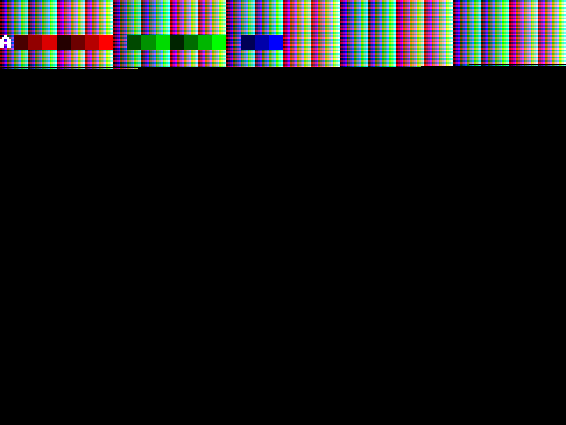

# FPGA Simulation

Simulation is the most important part of Verilog development for this project. Logic quickly becomes too complex to validate by just reading code, hardware testing is slow, and most importantly it gives no insight into what's actually happening inside the design. This page covers how to set up the simulation environment, run your first simulation, and write your own test programs.

## Prerequisites

You need the following installed on your system (tested on Ubuntu 25.04):

| Tool | Version | Purpose |
|---|---|---|
| Python | >= 3.13 | Assembler, test runner, build scripts |
| uv | Latest | Python package manager (replaces pip/venv) |
| Icarus Verilog | >= 12.0 | Verilog simulation (older versions won't work) |
| GTKWave | Latest | Waveform viewer for debugging |
| GCC | Any recent | Compiling the B32CC C compiler |

On Ubuntu/Debian:

```bash
sudo apt install iverilog gtkwave gcc
```

For `uv`, follow the [installation guide](https://docs.astral.sh/uv/getting-started/installation/).

## Initial Setup

Run `make` from the project root. This does four things in order:

1. Creates a Python virtual environment and installs all dependencies
2. Compiles B32CC (the C compiler) from C source
3. Installs ASMPY (the assembler) as an editable Python package
4. Runs all checks (format, lint, tests)

```bash
git clone <repo> && cd FPGC
make
```

If everything passes, your environment is ready.

## Running Your First Simulation

The interactive CPU simulation compiles some assembly programs and runs the full FPGC design in Icarus Verilog, then opens GTKWave for waveform inspection:

```bash
make sim-cpu
```

This assembles three files from `Software/ASM/Simulation/`:

- `sim_rom.asm` as the ROM contents
- `sim_ram.asm` as the SDRAM contents (loaded at address 0)
- `sim_spiflash1.asm` as the SPI Flash 1 contents

Edit these files to change what the simulated FPGC runs. After simulation, GTKWave opens with a preconfigured view showing key signals.

To simulate booting via the UART bootloader instead:

```bash
make sim-cpu-uart
```

## Running Tests

**CPU tests** run all assembly tests in `Tests/CPU/`, executing each twice (once from ROM, once from RAM/SDRAM):

```bash
make test-cpu
```

**Compiler tests** compile all C tests through the full pipeline (C to assembly to simulation to result verification):

```bash
make test-b32cc
```

**Run a single test** for faster iteration:

```bash
make test-cpu-single file=1_load.asm
make test-b32cc-single file=04_control_flow/if_statements.c
```

Tests run in parallel with 4 workers by default. Each simulation uses a fair amount of RAM, so on machines with less than 16 GB you might want to keep the default. On beefy machines, increase it:

```bash
export FPGC_TEST_WORKERS=12
```

## Writing a CPU Test

Create an assembly file in `Tests/CPU/`:

```asm
; Tests/CPU/my_test.asm
Main:
    load 37 r15         ; expected=37
    halt
```

The test framework expects:

- A `Main:` label as the entry point
- The result in `r15`
- An `; expected=XX` comment with the expected value

Run it with `make test-cpu-single file=my_test.asm`.

## Writing a Compiler Test

Create a C file in `Tests/C/`:

```c
// Tests/C/my_test.c
int main() {
    int x = 6;
    int y = 7;
    return x * y; // expected=0x2A
}

void interrupt() {}
```

Include `// expected=0xXX` for the expected return value. The `interrupt()` function is required. Run with:

```bash
make test-b32cc-single file=my_test.c
```

## Debugging with GTKWave

To debug a specific test with waveform output:

```bash
make debug-cpu file=1_load.asm
make debug-b32cc file=04_control_flow/if_statements.c
```

This runs the simulation and opens GTKWave. The `.gtkw` configuration files in the Verilog simulation directory provide useful pre-selected signals.

## GPU Simulation

```bash
make sim-gpu
```

This runs the GPU testbench and opens GTKWave. The GPU also outputs PPM image files (one per vsync pulse) for visual verification of the rendered frame. Ubuntu can view PPM files natively.

You need to simulate for an entire frame duration to get a complete image, which can take several seconds. You might need to adjust the GPU clock speed in the testbench to avoid partially drawn frames.


