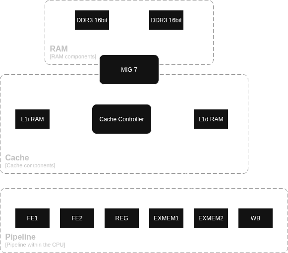

# Cache (WIP)

As the main performance bottleneck slowing down the CPU (even at 50MHz) is RAM, a cache is needed to keep the CPU fed with instructions and avoid stalls. Specifically, the FPGC contains an L1 instruction (L1i) and L1 data (L1d) cache. This is even more needed for newer types of memory like DDR3, which require a burst length of 8. Instead of trying to write a single word and ignoring the other seven words, using a cache line of 8 words is much more efficient, especially since DRAM is very fast sequentially.

!!! note
    The cache design has been made specifically for DDR3 with a bus width of 32 bits (two 16 bit chips in parallel), as this is what is present on the FPGA core PCB I am using currently. This means my own SDRAM controller has to be replaced by a MIG 7 IP from Xilinx, as DDR3 is currently too complex for me to write my own controller for. If you want to use a different type/configuration of memory, you should only have to change the memory write/read state in the cache controller, and replace the MIG 7 for your own SDRAM controller, as the controller will only do a simple 8 word burst read or write when the DRAM interface indicates it is ready to receive a command.

## Specifications

The L1i and L1d cache each contain:

- 128 lines of 8 words (256 bits) for 4KiB or 1024 words of memory for data
- Direct-mapped structure for simplicity
- 16 bits per line for tag
- 1 valid bit per line
- 1 dirty bit per line (unused in L1i cache)

## Cache strategy

Within the CPU pipeline, there are two stages for each memory type. For L1i, the first stage FE1 directly requests the relevant cache line from the L1i cache SRAM. In the next stage FE2, a check is done for a cache hit or cache miss. In case of a cache hit, the instruction is selected from the cache data and passed to the next stage. In case of a cache miss, the pipeline is stalled until the cache miss is handled and the resulting instruction is passed to the next stage. The same happens for L1d cache, where the cache is requested during the EXE stage, and cache hits or misses are handled in the MEM stage.

### Architecture

### Cache controller

During a cache miss on the L1i cache, or a write on the L1d cache, the cache controller is requested. The cache controller also has direct access to the cache SRAM as it is dual port, and is also connected to the SDRAM controller (MIG 7 for DDR3 on the Artix 7 board I am currently using). For the L1i cache, in case of a cache miss the cache controller fetches the new cache line with the requested instruction from the SDRAM controller, then writes the new cache line with the valid bit set to the cache SRAM, after which it returns the requested instruction to the CPU pipeline. For a L1d there is an extra step, where the evicted cache line is first written back to SDRAM if the dirty bit is set. For writes on a cache hit, the cache line is read, updated and written back with the dirty bit set (which does mean there is an extra read as the line already has been read during the EXE stage, but this is a lot simpler and only costs a cycle during a write hit).

### Connection to the SDRAM controller

As the CPU is pipelined, both the L1i and L1d cache might want to request SDRAM at the same time. Therefore we need some kind of arbiteration. Furtherfore, the MIG 7 (user) interface runs at a minimum speed of 100MHz (possibly 75MHz with some configuration change, but that might cause other issues). As the FPGC will likely run at 50MHz, there will also be need for some clock domain crossing. Luckily, the 100MHz of the MIG 7 and the 50MHz from the CPU should be able to run in sync, allowing for much simpler and faster clock domain crossing as it is just a 2 to 1 ratio.

To keep complexity low with arbiteration and clock domain crossing, I choose to create a single cache controller that handles both L1i and L1d cache misses in a single state machine, where the controller and cache RAM run at 100MHz. While this might be slower than having two independent cache controllers, this strategy will most likely make implementing and validating the design a lot easier and will only result in slowdowns when both L1i and L1d caches need the controller at the same time. Having only one controller allows me to handle everything in a big state machine, making arbiteration trivial. Furthermore, running this and the RAM instances at 100MHz means that only the output signals to the CPU need to be held for a cycle longer to align with the 50MHz, with the added bonus of the entire cache controller running twice as fast for performance improvements.
