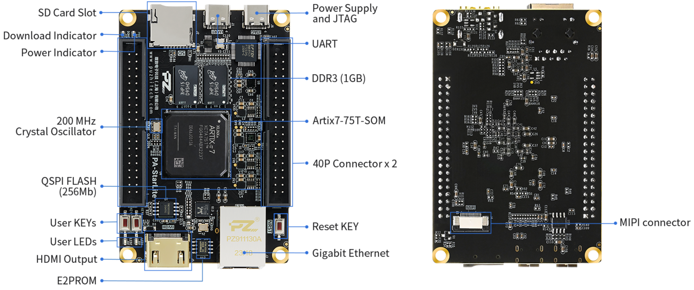

# FPGA

The FPGC project targets Xilinx Artix 7 XC7A75T FPGA, specifically on the PuZhi PZ-A75T StarLite development board.

## FPGA development board

The PuZhi PZ-A75T StarLite development board was chosen for the following reasons:

- The FPGA contains enough block RAM to contain a 320x240x8-bit framebuffer
- The board contains a 32 bit wide bus to the SDRAM, which alligns well with the 32 bit architecture of the CPU
- The board contains enough 2.54mm pitch pin headers to connect all the I/O needed to make a full featured computer

Furthermore, this development board has the following extra features that are useful for this project:

- A HDMI port connected to TMDS pins on the FPGA, allowing for great compatibility with basically all HDMI inputs
- Two USB C ports, one for UART and one for JTAG programming, with a programmer on board saving the need for an external programmer
- A microSD card slot
- 1GB of DDR3 SDRAM, which is near infinite memory for this project, even more than needed for persistent storage

However, this board has the following disadvantages:

- The SDRAM memory is DDR3, which is way more complex to interface with than SDR SDRAM which I used in the past and is more common on Altera FPGA boards. Practically, this forces me to use the MIG 7 memory controller IP from Xilinx instead of my own SDRAM controller, which complicates both simulation and the design, and most likely will introduce a bunch of latency (although should have more throughput)
- The USB to UART bridge does not have the DTR pin connected, which requires a patch wire to be soldered to an I/O pin on the FPGA
- The Gigabit Ethernet PHY is currently too complex to interface with, requiring me to add a different Ethernet controller to the I/O board, like a W5500 or ENC28J60

(Source: [PuZhi](https://www.puzhi.com/en/detail/433.html))

## FPGA choise

The FPGA itself this project targets is a Xilinx Artix 7 XC7A75T. In general there is no specific reason to choose a particular FPGA, as long as it has enough block RAM to contain the framebuffer and enough I/O pins to connect all the peripherals (which FPGA's generally have but usually are limited by the board they are soldered on). However, this FPGA has the advantage of containing TMDS pins, which allows for interfacing with HDMI without the need for an external HDMI controller that are usually hard to solder and/or require a lot of pins. The XC7A75T has the following (relevant) specifications:

- 75K logic cells
- 180 DSP slices
- 3.7Mb of block RAM
- 300 I/O pins

## Future ideas

To compensate for the disadvantages of the board, in the future I could use a Artix 7 Core Module, which only has the FPGA, DDR3, oscillator and voltage regulators, and has a very large amount of dense I/O pins on the bottom connectors. This would allow me to design a custom I/O board with the following features:

- 2x 16 bit wide SDR SDRAM, allowing me to use my own SDRAM controller as alternative to the MIG 7 IP (which could still be used as the DDR3 is located on the core module)
- HDMI on the I/O board while still being connected to the FPGA TMDS pins
- All other features I would normally need, like USB, Ethernet, etc.
