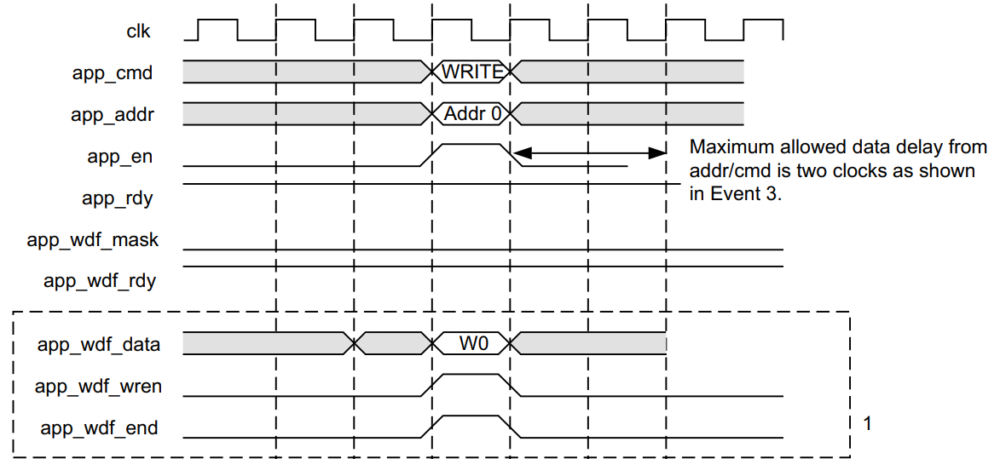
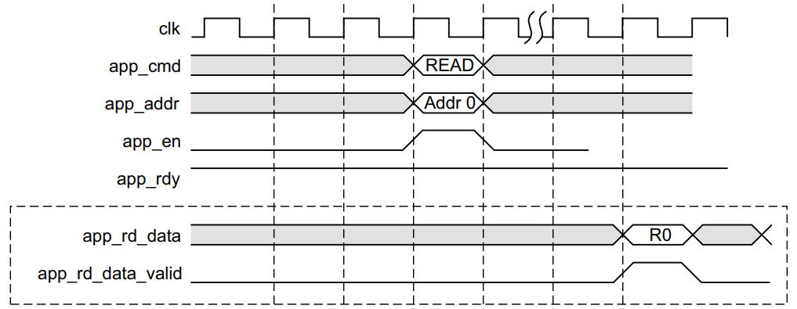

# MIG 7

This documentation page is a markdown summary/copy of parts of the Xilinx MIG 7 Series user guide documentation that can be found [from the Xilinx website](https://www.xilinx.com/support/documents/ip_documentation/mig_7series/v4_1/ug586_7Series_MIS.pdf). I find this useful to have for checking how to interface with the MIG 7.

## MIG 7 Interface Signals

| **Signal** | **Direction** | **Description** |
|------------|---------------|-----------------|
| `app_addr[ADDR_WIDTH – 1:0]` | Input | This input indicates the address for the current request. |
| `app_cmd[2:0]` | Input | This input selects the command for the current request. |
| `app_en` | Input | This is the active-High strobe for the `app_addr[]`, `app_cmd[2:0]`, `app_sz`, and `app_hi_pri` inputs. |
| `app_rdy` | Output | This output indicates that the UI is ready to accept commands. If the signal is deasserted when `app_en` is enabled, the current `app_cmd` and `app_addr` must be retried until `app_rdy` is asserted. |
| `app_hi_pri` | Input | This active-High input elevates the priority of the current request. |
| `app_rd_data[APP_DATA_WIDTH – 1:0]` | Output | This provides the output data from read commands. |
| `app_rd_data_end` | Output | This active-High output indicates that the current clock cycle is the last cycle of output data on `app_rd_data[]`. This is valid only when `app_rd_data_valid` is active-High. |
| `app_rd_data_valid` | Output | This active-High output indicates that `app_rd_data[]` is valid. |
| `app_sz` | Input | This input is reserved and should be tied to 0. |
| `app_wdf_data[APP_DATA_WIDTH – 1:0]` | Input | This provides the data for write commands. |
| `app_wdf_end` | Input | This active-High input indicates that the current clock cycle is the last cycle of input data on `app_wdf_data[]`. |
| `app_wdf_mask[APP_MASK_WIDTH – 1:0]` | Input | This provides the mask for `app_wdf_data[]`. |
| `app_wdf_rdy` | Output | This output indicates that the write data FIFO is ready to receive data. Write data is accepted when `app_wdf_rdy = 1’b1` and `app_wdf_wren = 1’b1`. |
| `app_wdf_wren` | Input | This is the active-High strobe for `app_wdf_data[]`. |
| `app_correct_en_i` | Input | When asserted, this active-High signal corrects single bit data errors. This input is valid only when ECC is enabled in the GUI. In the example design, this signal is always tied to 1. |
| `app_sr_req` | Input | This input is reserved and should be tied to 0. |
| `app_sr_active` | Output | This output is reserved. |
| `app_ref_req` | Input | This active-High input requests that a refresh command be issued to the DRAM. |
| `app_ref_ack` | Output | This active-High output indicates that the Memory Controller has sent the requested refresh command to the PHY interface. |
| `app_zq_req` | Input | This active-High input requests that a ZQ calibration command be issued to the DRAM. |
| `app_zq_ack` | Output | This active-High output indicates that the Memory Controller has sent the requested ZQ calibration command to the PHY interface. |
| `ui_clk` | Output | This UI clock must be a half or quarter of the DRAM clock. |
| `init_calib_complete` | Output | PHY asserts `init_calib_complete` when calibration is finished. |
| `app_ecc_multiple_err[7:0]` | Output | This signal is applicable when ECC is enabled and is valid along with `app_rd_data_valid`. The `app_ecc_multiple_err[3:0]` signal is non-zero if the read data from the external memory has two-bit errors per beat of the read burst. The SECDED algorithm does not correct the corresponding read data and puts a non-zero value on this signal to notify the corrupted read data at the UI. |
| `ui_clk_sync_rst` | Output | This is the active-High UI reset. |
| `app_ecc_single_err[7:0]` | Output | This signal is applicable when ECC is enabled and is valid along with `app_rd_data_valid`. The `app_ecc_single_err` signal is non-zero if the read data from the external memory has a single-bit error per beat of the read burst. |

### Signal Descriptions

#### `app_addr[ADDR_WIDTH – 1:0]`

This input indicates the address for the request currently being submitted to the UI. The UI aggregates all the address fields of the external SDRAM and presents a flat address space to you.

!!! warning
    Apparently the addresses are byte addresses, even though the data width is (in my case) 256 bits. To me this was unclear from the documentation. Ignoring this will cause data to be overwritten on nearby addresses.

---

#### `app_cmd[2:0]`

This input specifies the command for the request currently being submitted to the UI. The available commands are shown below:

| Operation | `app_cmd[2:0]` Code |
|-----------|----------------------|
| Read      | 001                  |
| Write     | 000                  |

---

#### `app_en`

This input strobes in a request. You must apply the desired values to `app_addr[]`, `app_cmd[2:0]`, and `app_hi_pri`, and then assert `app_en` to submit the request to the UI. This initiates a handshake that the UI acknowledges by asserting `app_rdy`.

---

#### `app_hi_pri`

This input indicates that the current request is a high priority.

---

#### `app_wdf_data[APP_DATA_WIDTH – 1:0]`

This bus provides the data currently being written to the external memory.

---

#### `app_wdf_end`

This input indicates that the data on the `app_wdf_data[]` bus in the current cycle is the last data for the current request.

---

#### `app_wdf_mask[APP_MASK_WIDTH – 1:0]`

This bus indicates which bytes of `app_wdf_data[]` are written to the external memory and which bytes remain in their current state. Bytes are masked by setting a value of `1` to the corresponding bits in `app_wdf_mask`.

**Example:**

- If the application data width is 256, the mask width is 32.
- Byte `[7:0]` of `app_wdf_data` is masked using Bit `0` of `app_wdf_mask`.
- Byte `[255:248]` is masked using Bit `31`.

To mask the last DWORD (bytes 0, 1, 2, and 3), set:

```verilog
app_wdf_mask = 32'h0000_000F;
```

---

#### `app_wdf_wren`

This input indicates that the data on the `app_wdf_data[]` bus is valid.

---

#### `app_rdy`

This output indicates whether the request currently being submitted to the UI is accepted. If the UI does not assert this signal after `app_en` is asserted, the current request must be retried.

**The `app_rdy` output is not asserted if:**

- PHY/Memory initialization is not completed.
- All bank machines are occupied (command buffer full).
    - A read is requested and the read buffer is full.
    - A write is requested and no write buffer pointers are available.
- A periodic read is being inserted.

---

#### `app_rd_data[APP_DATA_WIDTH – 1:0]`

This output contains the data read from the external memory.

---

#### `app_rd_data_end`

This output indicates that the data on the `app_rd_data[]` bus in the current cycle is the last data for the current request.

---

#### `app_rd_data_valid`

This output indicates that the data on the `app_rd_data[]` bus is valid.

---

#### `app_wdf_rdy`

This output indicates that the write data FIFO is ready to receive data. Write data is accepted when both `app_wdf_rdy` and `app_wdf_wren` are asserted.

---

#### `app_ref_req`

When asserted, this active-High input requests that the Memory Controller send a refresh command to the DRAM. It must be pulsed for a single cycle to make the request and then deasserted at least until the `app_ref_ack` signal is asserted to acknowledge the request and indicate that it has been sent.

---

#### `app_ref_ack`

When asserted, this active-High input acknowledges a refresh request and indicates that the command has been sent from the Memory Controller to the PHY.

---

#### `app_zq_req`

When asserted, this active-High input requests that the Memory Controller send a ZQ calibration command to the DRAM. It must be pulsed for a single cycle to make the request and then deasserted at least until the `app_zq_ack` signal is asserted to acknowledge the request and indicate that it has been sent.

---

#### `app_zq_ack`

When asserted, this active-High input acknowledges a ZQ calibration request and indicates that the command has been sent from the Memory Controller to the PHY.

---

#### `ui_clk_sync_rst`

This is the reset from the UI which is synchronous with `ui_clk`.

---

#### `ui_clk`

This is the output clock from the UI. It must be a half or quarter the frequency of the external SDRAM clock, depending on whether 2:1 or 4:1 mode is selected in the GUI.

---

#### `init_calib_complete`

The PHY asserts `init_calib_complete` when calibration is finished. The application does not need to wait for `init_calib_complete` before sending commands to the Memory Controller.

## Write timing example

This is a screenshot from the documentation of a non back-to-back write command. This looks exactly like how I would want to send the request in a single cycle.


## Read timing example

This is a screenshot from the documentation of a read command, where you only make a new read request after the previous one has been completed. This looks exactly like how I would want to implement it.


## Other notes from the documentation

While reading the documentation, I found the following notes that could be relevant during implementation:

- The MIG 7 is very complex and optimized for throughput. It will most likely add a great bunch of latency compared to a "simple" SDRAM controller.
    - According to the documentation, controller mode `STRICT` reduces latency, so I should not forget to set that in Vivado.
    - As a future optimization idea, assuming the basic implemenation works good enough, I could implement a write buffer to further reduce the latency impact
- To send a command, we can put `app_en` high at any moment, until both `app_en` and `app_ready` are both high for a clock cycle. Make sure both are not high for multiple clock cycles, as this will likely result in multiple commands queried in the internal FIFO (see page 166).
- Make sure `app_wdf_rdy` is high before sending a write command (although I do not think I will ever fill the FIFO until implementation of a write buffer).
- Since my DDR3 memory together has a bus width of 32 bits, with the required burst length of 8 (BL8) I should be able to request a read or write of an entire 256 bit cache line in a single cycle, greatly simplifying the design.
- The addresses are byte addresses, requiring a bitshift of 5 for 256 bit (32 byte) accesses.
