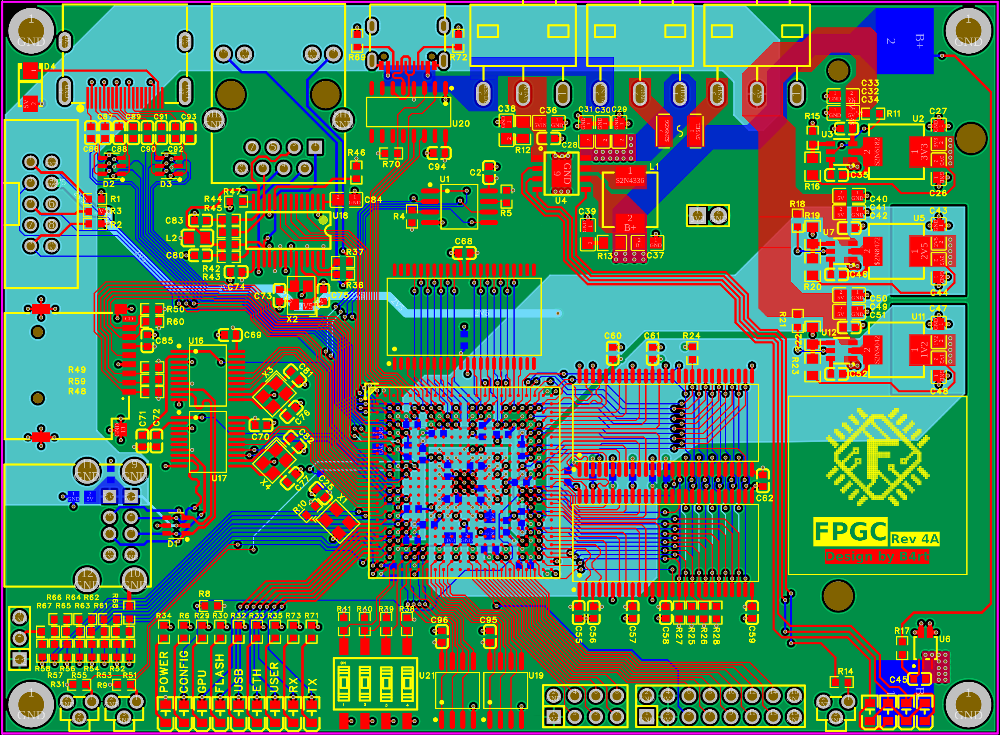
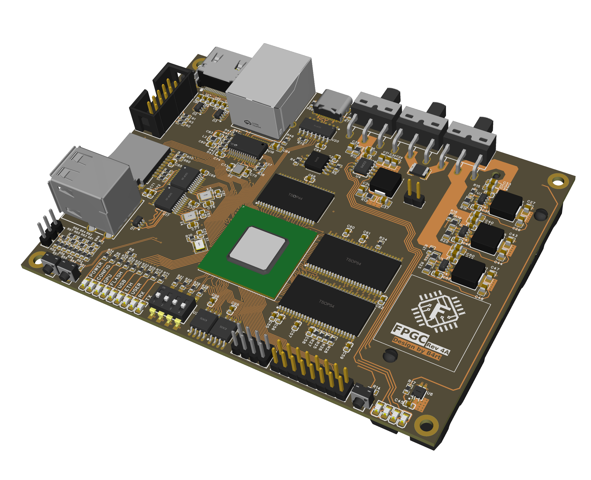
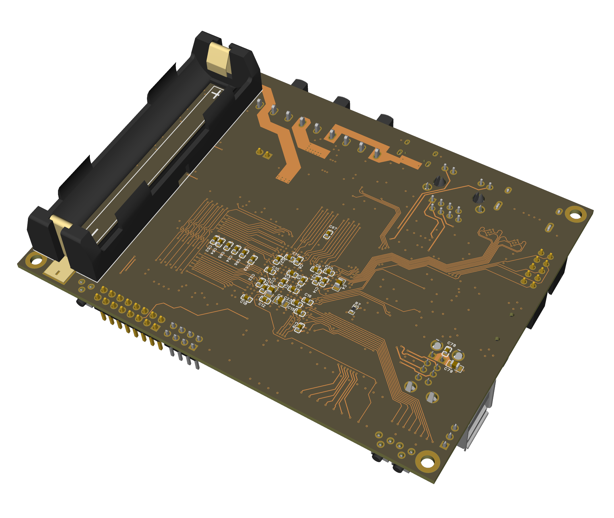
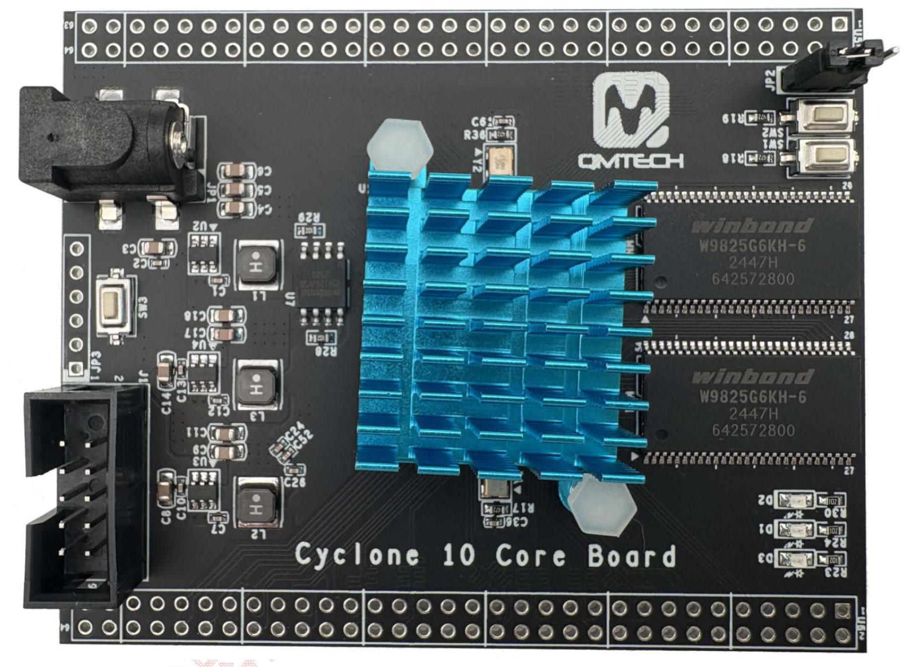

# PCB

Previous versions of the FPGC used an FPGA development board or module with a custom designed I/O PCB. This was mainly done as soldering a BGA FPGA was not easy given the equipment and BGA soldering experience. This actually worked really well since the QMTECH modules used were cheap, compact, contained SDRAM and a lot of I/O pins on headers. However, at this stage of the project I am able to spend more money on the project (as I am not a student anymore), and these days it is exceptionally easy to order a custom PCB with assembly of (BGA) components for a reasonable price. Therefore I designed a complete custom PCB for the FPGC.

!!! Note
    The FPGC still supports using the QMTECH Cyclone 10 10CL120 module as alternative to the custom PCB. However, the main focus of the project is now on the custom PCB.

!!! TODO
    Add pictures of the assembled PCB + cluster setup.

## Main PCB features

The custom PCB contains the following main components:

- Intel/Altera Cyclone IV FPGA (EP4CE40F23I7N)
- 2x 32MB SDRAM (W9825G6JH-6)
- 1x 4Mbit@8bit SRAM (IS61LV5128AL-10TLI)
- IP5306 power bank management IC for 18650 Li-ion battery operation
- 3.3V, 2.5V and 1.2V voltage regulators (TPS563201DDCR)
- Several I/O devices:
    - HDMI output (AC decoupled with TVS diodes)
    - 2x USB A Host using CH376t (no MAX3421E as these were out of stock or very expensive)
    - MicroSD card slot
    - 10Mbit Ethernet via ENC28J60
    - USB UART via CH340C
    - 2x 128Mbit SPI Flash (W25Q128JVSIQ)
    - 8 bit R2R DAC for future audio output
    - Display header for a display such as the ST7920 or Nokia 5110 module
    - A buch of status LEDs and input switches
    - Extra GPIO pins for future expansion

The result is a 120mm x 88.3mm 6 layer PCB designed with EasyEDA, and manufactured and assembled by JLCPCB (with parts from LCSC/JLCPCB). The project file is available in the `Hardware/PCB` folder of the project.

!!! Note
    The SRAM IC was chosen to move the framebuffer from the internal FPGA block RAM to external SRAM, freeing up a lot of block RAM, which is relatively limited on the EP4CE40 FPGA (although it does have enough). While using external SRAM requires more complex logic to interface with it as it is not dual port, it does make the design more realistic as this is how most computers work, especially in the era of similar performing systems.

## Schematic

!!! Warning
    After ordering the PCB, I found two large mistakes in the schematic:

    1. All three TVS protection IC's for HDMI and USB have their supply and ground pins swapped, effectively shorting the supply.
    2. The microSD card slot also has its supply and ground pins swapped and need to be corrected to work. Sadly the GND trace is below the connector and the pins are not easy to lift, so they have to be desoldered and resoldered correctly.

    A minor mistake is that the battery holder is too close to the mounting holes, meaning you might have to cut away a bit of plastic from the holder depending on the screws and standoffs used.

    As for the LEDs, the FPGA_conf_done LED is quite dim compared to the others, most likely due to the R8 pull up which cannot be removed. The IP5306 status LEDs are really bright, not sure if those can be easily dimmed given the 3 pin direct IC connection.

The schematic PDF export can be downloaded here: [Schematic.pdf](../assets/schematic.pdf)

## PCB Layout

A screenshot of the PCB layout in EasyEDA is shown below.

## PCB Render

The following 3d renders show the top and bottom layers of the assembled PCB (in copper color for visibility).

### Top

### Bottom

## Alternative platforms

### QMTECH Cyclone 10 10CL120 Module

The QMTECH Cyclone 10 module is a compact FPGA module containing an Intel Cyclone 10 LP 10CL120 FPGA with two onboard SDRAM ICs, exposing 64MiB at a 32 bits bus. The module very cheap given the hardware, and provides a good amount of I/O pins through pin headers, making it suitable for use with a custom I/O board.

!!! Note
    While the boards from QMTECH are generally extremely suited for a project like this (very cheap, small size, black PCB, good documentation, contains memory), the boards seem to be only in stock for a limited time before they are discontinued (which raises questions on how they source their chips). This has already happed with the Cyclone IV EP4CE15 Cyclone V 5CEFA5F23 modules I used in previous versions of the FPGC project.

{ width="50%" }

(Source: [QMTECH](https://github.com/ChinaQMTECH/Cyclone_10LP_10CL120YF484_Core_Board))
