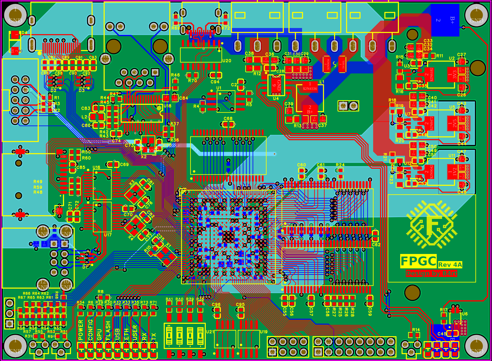
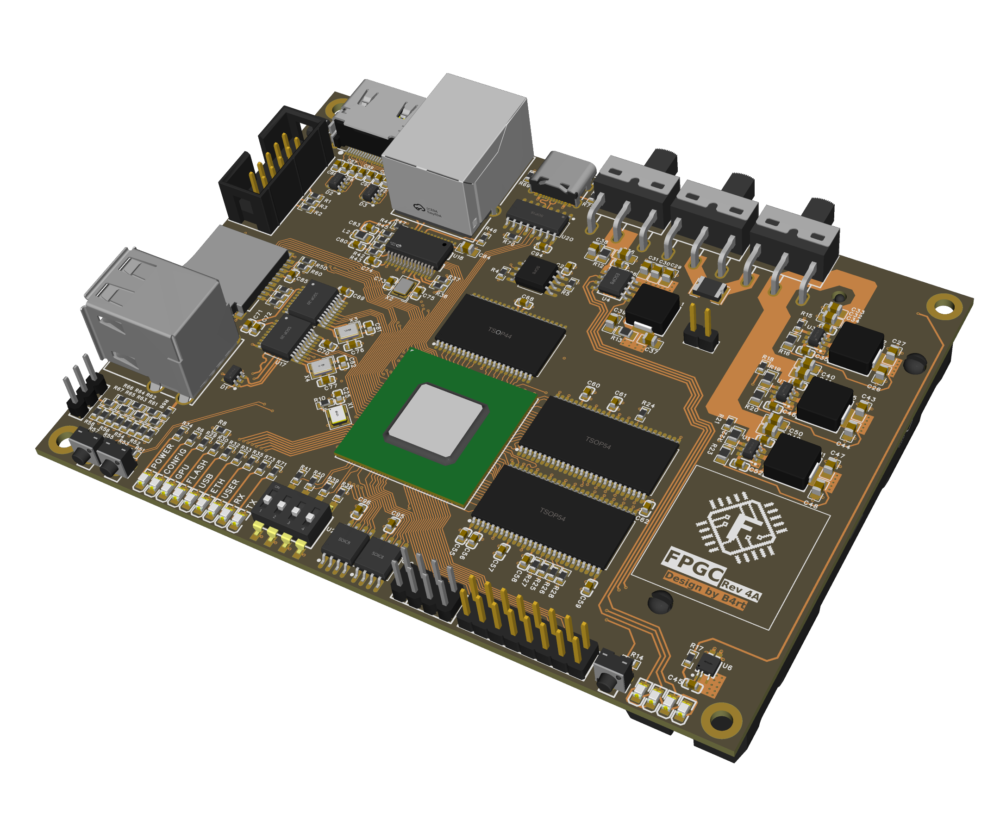
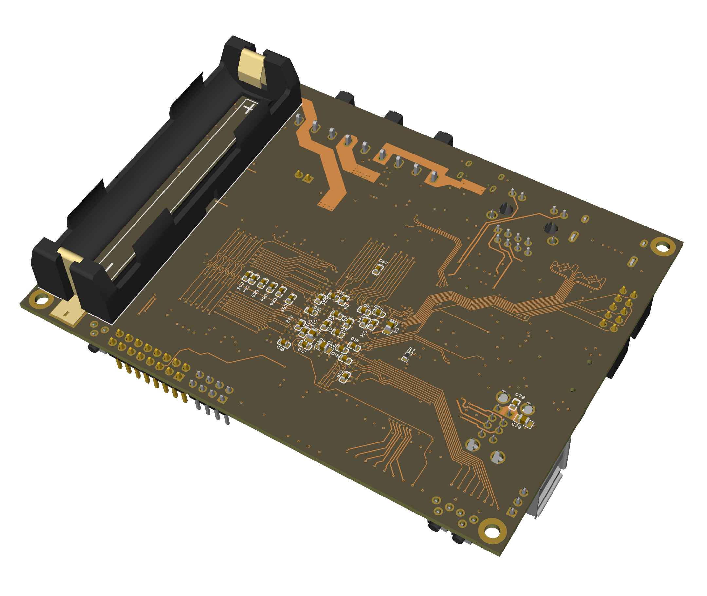

# PCB

Previous FPGC versions used an FPGA development module (QMTECH) with a custom I/O daughter board. This was challenging because there are only limited boards available that are small, cheap, have double SDRAM, and have enough IO pins routed outwards. Therefore, the current version has a fully custom PCB designed in EasyEDA and manufactured by JLCPCB including assembly.

## Components

The PCB is a 120mm x 88.3mm, 6-layer board containing:

**Processing and Memory:**

- Intel/Altera Cyclone IV FPGA (EP4CE40F23I7N)
- 2x 32 MB SDRAM (W9825G6JH-6), wired as 32-bit bus
- 1x 512 KB SRAM (IS61LV5128AL-10TLI) for pixel framebuffer

**Power:**

- IP5306 power bank management IC for 18650 Li-ion battery operation
- 3.3V, 2.5V, and 1.2V voltage regulators (TPS563201DDCR)

**I/O Devices:**

- HDMI output (AC-coupled with TVS protection)
- 2x USB-A Host via CH376T
- MicroSD card slot
- 10 Mbit Ethernet via ENC28J60
- USB UART via CH340C
- 2x 128 Mbit SPI Flash (W25Q128JVSIQ)
- 8-bit R2R DAC for future audio output
- Display header (for ST7920 or Nokia 5110 modules), but could be used for generic GPIO as well
- Status LEDs, DIP switches, and extra GPIO pins

## Design Notes

The external SRAM was chosen to move the pixel framebuffer out of FPGA block RAM. While interfacing with single-port external SRAM requires arbitration logic (time-division multiplexing between GPU reads and CPU writes), it frees up a significant amount of BRAM and makes the design more authentic to the era of hardware this project draws inspiration from.

The project file is in the `Hardware/PCB` folder.

## Known Issues

The first PCB revision has two wiring errors:

1. All three TVS protection ICs (HDMI and USB) have supply and ground pins swapped, shorting the supply. These need to be corrected manually.
2. The microSD card slot also has swapped supply and ground. The GND trace runs under the connector, so the connector must be desoldered to fix.

A minor issue: the battery holder is too close to the mounting holes, which may require trimming depending on the standoffs used.

## Schematic

The schematic PDF export can be downloaded here: [Schematic.pdf](../assets/schematic.pdf)

## PCB Layout and Render

The following 3d renders show the top and bottom layers of the assembled PCB (in copper color for visibility).

### Top

### Bottom

